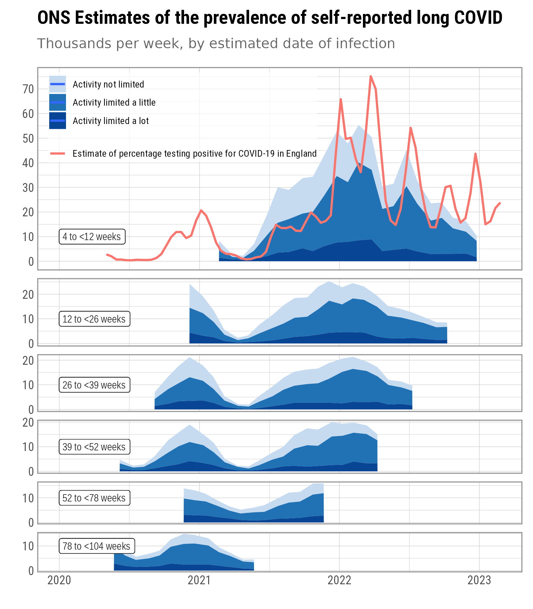

# Prevalence of ongoing symptoms following coronavirus (COVID-19) infection in the UK
This repository contains the results from the [ONS long COVID survey](https://www.ons.gov.uk/peoplepopulationandcommunity/healthandsocialcare/conditionsanddiseases/datasets/alldatarelatingtoprevalenceofongoingsymptomsfollowingcoronaviruscovid19infectionintheuk).
You can download the raw data under [data/tidy_ons_longcovid.csv](data/tidy_ons_longcovid.csv).

Click on an image to see it in full resolution.

## Current estimates 
These are the latest estimate of the number or percentage of people in the population experinencing long COVID symptoms.

> Estimates relate to self-reported long COVID, as experienced by study participants, rather than clinically diagnosed ongoing symptomatic COVID-19 or post COVID-19 syndrome. Study participants were asked to respond to the following questions: "Would you describe yourself as having 'long COVID', that is, you are still experiencing symptoms more than 4 weeks after you first had COVID-19, that are not explained by something else?"

## Trend
The following graphs explore the trend by stratifying the data by "time since first infection", described by ONS as:
> Date of first (suspected) COVID-19 infection was taken to be the earliest of: date of first positive test for COVID-19 during study follow-up; date of first self-reported positive test for COVID-19 outside of study follow-up; date of first suspected coronavirus infection, as reported by the participant. 

Participants were _not_ asked for how long the symptoms have persisted. 

## By date of infection
The regular interval of survey updates and the narrow range of "weeks since first infection" allow us to backdate the cases to the date when they were likely infected. This allows us to estimate the relative burden of each wave as well as getting an idea of at which pace with which the fraction still experiencing symptoms come down.

## Notes from the ONS
> Estimates for the four-week periods ending 6 March 2021 to 31 July 2022 were based on face-to-face data collection and are comparable to each other, but not to estimates published after this. 

> Estimates for the four-week periods ending 3 September 2022 onwards were based on remote data collection and are comparable to each other, but not to estimates published before this.
